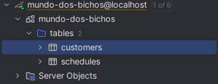
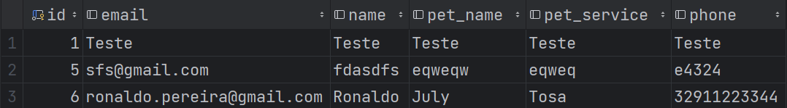
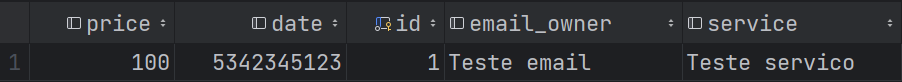

# mdb-spring

## Sobre
API RESTful feita em Java usando Spring Boot, Spring Data, Hibernate e Mysql.

Esta API foi feita para ser a peça principal do backend do projeto [Mundo dos Bichos](https://github.com/maccuci/mundo-dos-bichos/).
Toda e qualquer alteração nessa branch pública não afeta a funcionalidade do projeto final.

Como o banco de dados é **local**, não há necessidade de implementação de middlewares de autenticação como OAuth.

**Possíveis Rotas:**
``localhost:8080/api/{"customers", "schedules"}``

**Rotas Legadas:**

_Usadas na versão 0.5.0 do projeto_

``localhost:3000/api/{"clientes", "agendamentos"}``

## Banco de Dados

Database

Customers table example

Schedules table example

